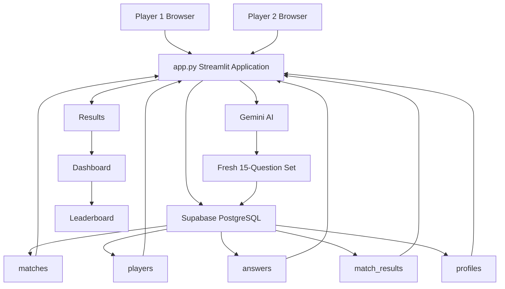
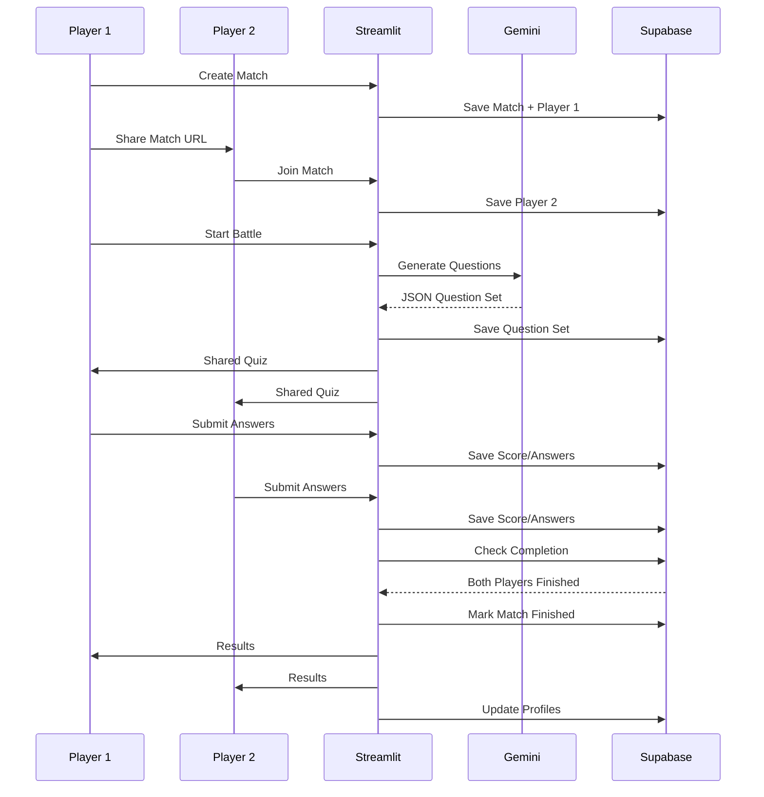

# 🧠 MirAI Capstone — Brain Battle Arena

> 🔴 **LIVE DEMO:** https://brainbattlearenbyhari.streamlit.app/

[](https://brainbattlearenbyhari.streamlit.app/)
[](https://www.python.org/)
[](https://supabase.com/)
[](https://ai.google.dev/)


> **An AI-powered 1v1 multiplayer quiz arena built with Streamlit, Gemini AI and Supabase.**

Brain Battle Arena is a competitive two-player quiz application created as a **MirAI Capstone Project**.  
Instead of running two independent quizzes, both players enter the **same shared match**, receive the **same AI-generated challenge**, compete under a **12-minute time limit**, and finally receive a detailed head-to-head result and performance dashboard.

---

## ⚡ Quick Start

```bash
git clone https://github.com/hariharan202135/mirai_capstone_brain_battle_arena.git
cd mirai_capstone_brain_battle_arena
pip install -r requirements.txt
streamlit run app.py
```

### Environment variables

Create a local `.env` file:

```env
SUPABASE_URL="your_supabase_url"
SUPABASE_KEY="your_supabase_key"
GEMINI_API_KEY="your_gemini_api_key"
```

> **Never commit `.env` or API keys to GitHub.**  
> Streamlit Community Cloud uses secure Secrets instead.

---

# 🎯 Problem Statement

Most quiz applications provide an isolated experience:

```text
User → Quiz → Score
```

Brain Battle Arena changes this into a multiplayer competition:

```text
Player 1 ─────┐
              ↓
          Shared Match
              ↓
           Supabase
              ↓
     ┌────────┴────────┐
     ↓                 ↓
 Player 1           Player 2
     ↓                 ↓
     └── Same AI Quiz ─┘
              ↓
          1v1 Battle
              ↓
      Winner + Analysis
```

The project combines:

- Artificial Intelligence
- Multiplayer state synchronization
- Persistent database storage
- Gamification
- Data analysis
- Custom Streamlit UI

---

# 🚀 Main Features

## ⚔️ 1v1 Multiplayer Match

Player 1 creates a battle and receives a unique match ID.

Example:

```text
BB-A82KQ1
```

The match is shared through a URL:

```text
```

Player 2 opens the same URL and joins the arena.

---

## 🎯 Topic Selection

The creator must choose exactly **5 topics**.

Available topics include:

- Logical Reasoning
- Number Patterns
- Mathematics
- Aptitude
- Brain Puzzles
- Riddles
- Verbal Ability
- Science
- Computer Fundamentals
- General Knowledge
- History
- Geography
- Economics
- Sports
- Movies & Entertainment

---

## 🎚️ Difficulty Selection

Players can choose:

```text
Easy
Medium
Hard
Mixed
```

The selected difficulty is passed dynamically into the Gemini prompt.

---

# 🤖 Gemini AI Question Engine

Gemini is used as a **specialized quiz-generation engine**, not as a generic chatbot.

For every battle, the AI is instructed to create:

- Exactly **15 questions**
- Exactly **3 questions per selected topic**
- Exactly **4 options per question**
- Exactly **one correct answer**
- A short explanation
- The requested difficulty

### Dynamic prompt context

The prompt is dynamically built using:

```python
topic_text
difficulty
freshness_id
previous_questions
```

This makes each AI request specific to the current battle.

---

# 🆕 Fresh Question Generation

A major project requirement is that players should not repeatedly receive the same questions.

The application uses several layers of protection.

### 1. Previous question retrieval

Recent question sets are read from the Supabase `matches` table.

### 2. DO-NOT-USE prompt list

Previous questions are passed to Gemini in a strict exclusion list.

The prompt explicitly instructs the model to:

```text
Never copy an old question.
Never paraphrase an old question.
Never slightly rewrite an old question.
Never only change numbers, names, dates or options.
Never reuse the same scenario or reasoning structure.
Never duplicate a question inside the current battle.
```

### 3. Programmatic validation

Python checks the generated response before the battle can use it.

Validation includes:

- 15-question count
- 3-per-topic count
- Four unique options
- Valid correct answer
- Duplicate detection within the new set
- Similarity checking against previous questions

If the generated set fails validation, the application requests another generation.

---

# 🗄️ Why Supabase Instead of Only `st.session_state`?

This is one of the important architectural decisions in the project.

`st.session_state` is useful for information belonging to one browser session.

However, Player 1 and Player 2 are separate Streamlit sessions.

For example:

```text
Player 1 browser
       ↓
Session State A

Player 2 browser
       ↓
Session State B
```

Those two sessions should not be responsible for storing the shared match.

Therefore, **Supabase PostgreSQL is used as the central source of truth for multiplayer state**.

Supabase stores:

- Match information
- Players
- Shared question set
- Scores
- Current question
- Answers
- Hints
- Streaks
- Final results
- Persistent player statistics

The architecture is therefore:

```text
Local temporary UI state
        ↓
st.session_state

Shared multiplayer state
        ↓
Supabase
```

---

# 🧱 Supabase Database

The current project uses five tables:

```text
answers
match_results
matches
players
profiles
```

## `matches`

Stores battle-level information.

Important fields include:

```text
id
match_code
status
topics
question_set
battle_start_time
created_at
difficulty
risk_questions
clutch_question
```

## `players`

Stores each player's live battle state:

```text
id
match_id
player_number
player_name
score
questions_answered
correct_answers
current_question
is_ready
joined_at
hints_left
best_streak
total_xp
matches_played
wins
losses
draws
```

## `answers`

Stores submitted answers:

```text
id
match_id
player_id
question_number
selected_answer
correct
points
response_time_seconds
answered_at
```

## `match_results`

Stores final comparison data:

```text
id
match_id
player1_score
player2_score
winner_player
player1_accuracy
player2_accuracy
completed_at
```

## `profiles`

Stores persistent player statistics:

```text
id
player_name
total_xp
matches_played
wins
losses
draws
total_score
best_streak
created_at
```

### Verified foreign-key relationships

```text
players.match_id
        ↓
matches.id

answers.match_id
        ↓
matches.id

answers.player_id
        ↓
players.id

match_results.match_id
        ↓
matches.id
```

The repository also contains `supabase_schema.sql` as a reproducibility/reference file. It does not replace the live Supabase database.

---

# 🎨 UI / UX

The project is built with **Streamlit**, with custom **HTML and CSS** used to create a polished gaming-style interface.

Custom styling is used for:

- Hero section
- Battle cards
- Question cards
- Result cards
- Topic cards
- Score cards
- Dark theme
- Rounded panels
- Progress indicators
- Responsive column layouts

The interface is designed around a competitive arena theme rather than a plain form-based quiz.

---

# 🧩 Streamlit Components Used

The project demonstrates a wide range of Streamlit components:

```text
st.set_page_config
st.markdown
st.columns
st.metric
st.progress
st.multiselect
st.radio
st.text_input
st.button
st.form
st.form_submit_button
st.toast
st.spinner
st.expander
st.dataframe
st.data_editor
st.fragment
st.session_state
st.query_params
```

---

# 📋 `st.form` Usage

The question-answer interaction uses a Streamlit form so the answer selection and submission are handled together.

This keeps the input flow cleaner and aligns with the capstone requirement to use forms for controlled submission/API interaction.

Example pattern:

```python
with st.form("answer_form"):
    answer = st.radio(...)
    submitted = st.form_submit_button("SUBMIT ANSWER")
```

---

# 📊 Pandas Data Analysis

Pandas is used for structured analysis of the final battle.

The result comparison is converted into a DataFrame containing:

```text
Player
Score
Correct
Accuracy
Best Streak
```

This table is displayed directly in the results screen.

This provides a cleaner and more structured analysis layer than manually rendering every comparison value.

---

# 📈 KPI Cards with Deltas

The results page uses dynamic `st.metric` cards.

Example:

```text
⭐ Score       500    +200
🎯 Correct       5      +2
📈 Accuracy     33%   +13%
🔥 Best Streak   1      -1
```

The delta shows the current player's performance relative to the opponent.

The dashboard also uses metric cards for persistent player statistics.

---

# 📝 Interactive Question Review

The result page includes a collapsible **Question Review** section.

The answer history is converted into a Pandas DataFrame and displayed using:

```python
st.data_editor(...)
```

Players can inspect:

- Player
- Question
- Topic
- Correct / Incorrect result

This adds an interactive data-viewing component to the results system.

---

# ⏱️ 12-Minute Battle

Each battle lasts:

```text
12 minutes
```

The battle start time is stored in Supabase.

Each browser calculates the remaining time using the shared start timestamp.

This prevents Player 1 and Player 2 from having unrelated timers.

---

# 💡 Hint System

Each player starts with a limited number of hints.

A hint helps eliminate one incorrect option.

The remaining hint count is stored in the shared `players` record.

---

# 🔥 Streak & Scoring System

Correct answers award points.

A streak bonus increases the score for consecutive correct answers.

Example logic:

```text
Correct answer
     ↓
Base points

3+ streak
     ↓
Bonus points

5+ streak
     ↓
Additional bonus
```

Incorrect answers reset the current streak.

---

# 👥 Opponent Progress

During the battle, a player can see opponent progress and score.

Example:

```text
You       8 / 15
Opponent  6 / 15
```

This information is read from Supabase rather than from a local session.

---

# 🔔 Lobby Notifications

When Player 2 joins the match, Player 1 receives a toast notification.

Example:

```text
🎉 Saran joined your arena!
```

This is implemented using:

```python
st.toast(...)
```

---

# 🔄 Anti-Blink Multiplayer Architecture

An important UI issue discovered during testing was excessive page blinking caused by refreshing the entire battle interface every second.

The final architecture avoids that.

### Static battle UI

The main battle interface is a normal Streamlit fragment.

### Small live fragments

Only changing areas refresh:

```text
Timer
    ↓ every 1 second

Opponent progress
    ↓ every 2 seconds

Finished-player watcher
    ↓ every 2 seconds
```

Normal answer submission reruns only the battle fragment.

Therefore:

```text
❌ Entire page every second
✅ Small dynamic sections only
```

This provides a much smoother user experience.

---

# 🏁 Battle Completion

When a player completes Question 15:

```text
Player 1
   ↓
15 / 15
   ↓
Waiting for opponent
```

A lightweight watcher continues checking Supabase.

When Player 2 also reaches:

```text
15 / 15
```

the application transitions the match to:

```text
finished
```

Both players then receive the results screen.

---

# 🏆 Results & Head-to-Head Analysis

After both players finish, the result screen displays:

- Winner or draw
- Player 1 score
- Player 2 score
- Correct answers
- Accuracy
- Best streak
- Score difference
- Pandas comparison table
- Question review

Example:

```text
🏆 Hari wins!

Hari
Score: 500
Correct: 5 / 15
Accuracy: 33%
Best Streak: 1

Saran
Score: 300
Correct: 3 / 15
Accuracy: 20%
Best Streak: 2
```

---

# 📊 Player Dashboard

Persistent player statistics are stored in Supabase and displayed in the dashboard.

Dashboard metrics include:

```text
Matches Played
Wins
Losses
Draws
Win Rate
Total XP
Level
Total Score
Best Streak
```

The dashboard also contains the global leaderboard.

---

# 🏅 XP and Leaderboard

Players earn XP based on match performance.

The `profiles` table stores persistent statistics.

The leaderboard sorts players by total XP.

```text
🥇 Player A — 9,450 XP
🥈 Player B — 8,920 XP
🥉 Player C — 8,400 XP
```

---

# 🔁 Complete Application Workflow

```text
1. Player 1 enters name
        ↓
2. Selects exactly 5 topics
        ↓
3. Selects difficulty
        ↓
4. Creates unique match
        ↓
5. Supabase stores match + Player 1
        ↓
6. Share match URL
        ↓
7. Player 2 joins
        ↓
8. Supabase stores Player 2
        ↓
9. Player 1 receives join notification
        ↓
10. Player 1 starts the battle
        ↓
11. Gemini generates 15 fresh questions
        ↓
12. Questions are validated for uniqueness
        ↓
13. Question set is stored in Supabase
        ↓
14. Both players receive the SAME questions
        ↓
15. 12-minute battle begins
        ↓
16. Players submit answers through st.form
        ↓
17. Answers and scores are stored in Supabase
        ↓
18. Hints, streaks and progress update
        ↓
19. Player 1 / Player 2 finish
        ↓
20. Database confirms both are complete
        ↓
21. Match becomes finished
        ↓
22. Winner is calculated
        ↓
23. Head-to-head analysis displayed
        ↓
24. Profile statistics updated
        ↓
25. Dashboard + leaderboard
```

---

# 🏗️ System Architecture



---

# 🔄 Data Flow



---

# ☁️ Deployment

The application is deployed on **Streamlit Community Cloud**.

```text
GitHub
   ↓
Streamlit Community Cloud
   ↓
Brain Battle Arena (`app.py`)
   ├── Gemini AI
   └── Supabase PostgreSQL
```

### 🔴 Live Application


The deployed application uses secure Streamlit Cloud Secrets for:

```text
SUPABASE_URL
SUPABASE_KEY
GEMINI_API_KEY
```


# 📦 Repository Structure

```text
mirai_capstone_brain_battle_arena/
│
├── app.py
├── requirements.txt
├── README.md
├── .gitignore
├── supabase_schema.sql
└── technical_design.md
```

### File purpose

| File | Purpose |
|---|---|
| `app.py` | Complete Streamlit application and battle logic |
| `requirements.txt` | Python dependencies for local use and Streamlit Cloud |
| `README.md` | Project overview, features, architecture, setup and workflow |
| `.gitignore` | Keeps secrets and temporary files out of GitHub |
| `supabase_schema.sql` | Reference schema for the Supabase PostgreSQL database |
| `technical_design.md` | Detailed system design, data flow and Mermaid diagrams |


# 🧪 Requirements

Typical dependencies:

```text
streamlit
supabase
google-genai
python-dotenv
pandas
```

The project intentionally avoids local system dependencies so it can run on Streamlit Community Cloud.

---

# 🔐 Security

The following must never be committed:

```text
.env
.streamlit/secrets.toml
API keys
Supabase passwords
```

Use `.gitignore` locally and Streamlit Secrets in deployment.

---

# 🎓 MirAI Capstone Alignment

This project was designed around the official capstone evaluation areas.

## 1. Technical Implementation & Architecture

Implemented:

- Python
- Streamlit
- `st.session_state`
- `st.form`
- Streamlit fragments
- Supabase shared state
- Pandas DataFrames
- Structured question validation
- Defensive error handling

## 2. AI Integration & Prompt Engineering

Implemented:

- Gemini API
- Dynamic prompts using topics and difficulty
- Fresh-generation identifiers
- Previous-question exclusion list
- Duplicate/similarity checks
- Structured JSON output
- AI as a dedicated quiz engine

> **Note:** The current application uses Gemini for text-based question generation. Camera/Microphone multimodality is not claimed here unless added separately.

## 3. UI/UX & Data Visualization

Implemented:

- Custom HTML/CSS
- Column layouts
- Hero sections
- Cards
- `st.metric`
- Metric deltas
- `st.expander`
- `st.dataframe`
- `st.data_editor`
- Progress indicators
- Toast notifications
- Non-blinking live battle architecture

## 4. Deployment & Cloud Engineering

Implemented:

- GitHub source control
- Streamlit Community Cloud deployment
- `requirements.txt`
- Secure cloud secrets
- Supabase cloud database
- Gemini API integration

## 5. Open-Source Branding

Repository includes:

- Professional README
- Architecture explanation
- Setup instructions
- Database information
- Deployment information
- Technical design documentation

## 6. System Design & Documentation

Included:

- Mermaid architecture diagram
- Data-flow diagram
- Database design
- API integration strategy
- Multiplayer synchronization logic
- Question-generation pipeline
- Results/dashboard workflow

---

# 🌟 What Makes Brain Battle Arena Different?

Brain Battle Arena is more than an AI-generated quiz.

It combines:

```text
AI Question Generation
        +
1v1 Multiplayer
        +
URL Match State
        +
Supabase Synchronization
        +
Timed Competition
        +
Gamification
        +
Pandas Analysis
        +
Persistent Profiles
        +
Leaderboard
```

The most important architectural idea is that **Gemini creates one challenge for the match, while Supabase acts as the shared source of truth for both players**.

---

# 🔮 Future Improvements

Possible future enhancements:

- User authentication
- Friend/invite system
- Tournament mode
- Spectator mode
- Match history page
- Topic-wise performance analytics
- AI post-match coaching
- Real-time Supabase subscriptions
- Camera-based puzzle challenges
- Microphone/voice-based challenge mode
- Advanced leaderboard filters

---

# 👨‍💻 Project

### MirAI Capstone Project

**Brain Battle Arena**

> *Choose your topics. Challenge your opponent. Outsmart them.*

Built with:

```text
Python
Streamlit
HTML
CSS
Gemini AI
Supabase
PostgreSQL
Pandas
GitHub
Streamlit Community Cloud
```
