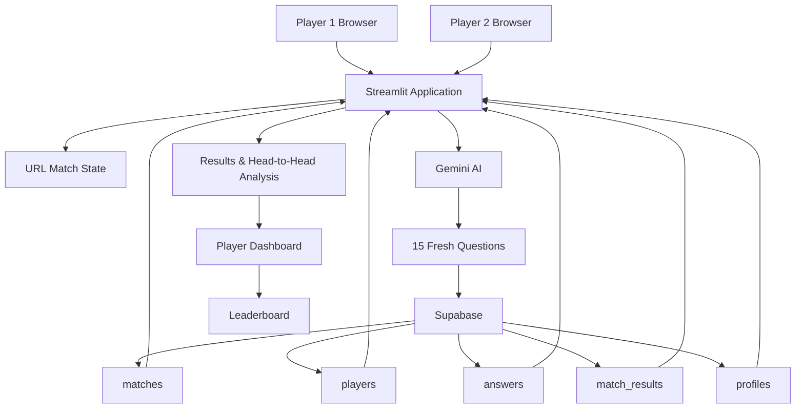
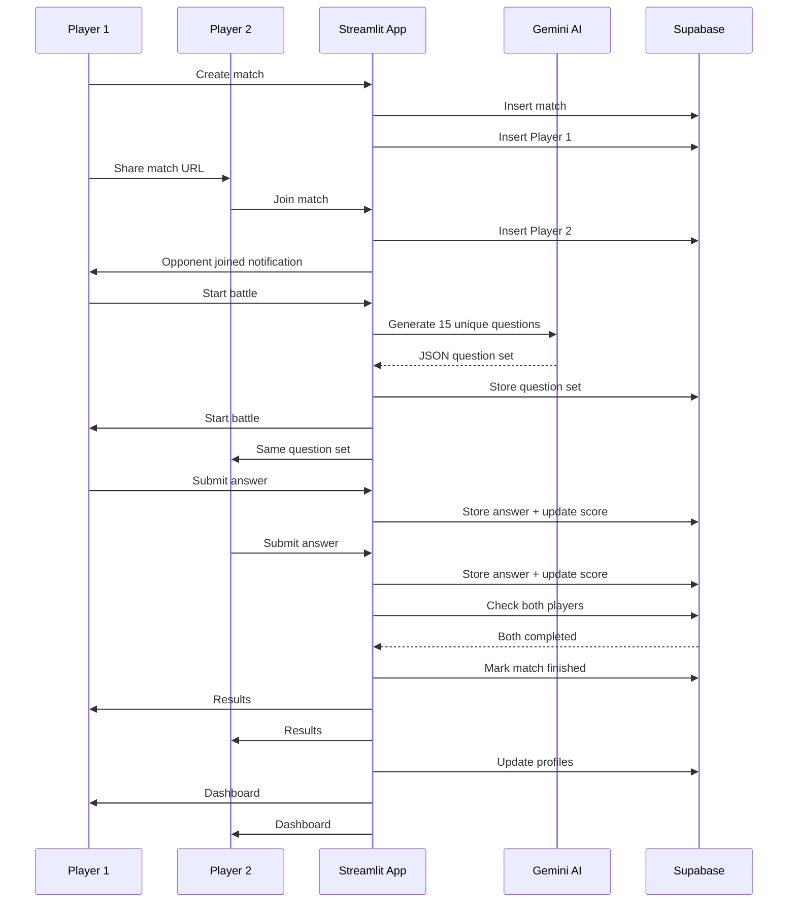

# Technical Design — MirAI Capstone Brain Battle Arena

## 1. Project Overview

Brain Battle Arena is an AI-powered 1v1 multiplayer quiz application built for the MirAI Capstone.

Two players join the same battle using a unique match URL. Player 1 creates the match, selects five topics and a difficulty level, and shares the generated URL with Player 2. When the battle starts, Gemini AI creates one shared set of 15 questions. The question set is stored in Supabase so both players receive exactly the same questions.

The battle lasts 12 minutes. Players earn points for correct answers, can use limited hints, build streaks, and see opponent progress. After both players finish, the system calculates the winner and displays a head-to-head comparison and player dashboard.

---

## 2. Technology Stack

| Layer | Technology |
|---|---|
| Programming Language | Python |
| UI Framework | Streamlit |
| UI Styling | Streamlit + custom HTML/CSS |
| AI | Google Gemini API |
| Database | Supabase PostgreSQL |
| Data Analysis | Pandas |
| Deployment | Streamlit Community Cloud |
| Version Control | GitHub |

---

## 3. High-Level Architecture



---

## 4. Application Modules

### 4.1 Streamlit UI Layer

The application interface is built with Streamlit.

It uses:

- `st.title`
- `st.markdown`
- `st.columns`
- `st.metric`
- `st.progress`
- `st.radio`
- `st.multiselect`
- `st.button`
- `st.form`
- `st.dataframe`
- `st.data_editor`
- `st.expander`
- Streamlit fragments

Custom HTML and CSS are used for the hero section, cards, question containers, result screens and dark battle-arena theme.

---

### 4.2 URL State Management

A match is identified through query parameters.

Example:

```text
?match=BB-ABC123&player=1
```

The two important values are:

- `match` — unique battle code
- `player` — player number

This allows two separate browser sessions to access the same match without requiring a login system.

---

## 5. State Management Design

### Local Session State

`st.session_state` is used for temporary browser/session information such as:

- dashboard navigation state
- temporary notifications
- player-specific UI state

### Shared Multiplayer State

Supabase is used for all state that must be shared between Player 1 and Player 2.

This is important because each player's Streamlit session is separate.

The following information is stored centrally:

- match status
- player names
- question set
- battle start time
- score
- current question
- correct answers
- hints
- streak
- answer history
- profile statistics

This prevents the two players from receiving different match states.

---

## 6. Database Design

The application uses five PostgreSQL tables in Supabase.

### `matches`

Stores battle-level information.

Important fields include:

- `id`
- `match_code`
- `status`
- `topics`
- `question_set`
- `battle_start_time`
- `difficulty`
- `created_at`

Match status follows this general flow:

```text
waiting
   ↓
generating
   ↓
battle
   ↓
finished
```

### `players`

Stores each participant's match state.

Important fields include:

- `match_id`
- `player_number`
- `player_name`
- `score`
- `questions_answered`
- `correct_answers`
- `current_question`
- `is_ready`
- `hints_left`
- `best_streak`

### `answers`

Stores submitted answers.

Important fields include:

- `match_id`
- `player_id`
- `question_number`
- `selected_answer`
- `correct`
- `points`
- `response_time_seconds`
- `answered_at`

### `match_results`

Stores final match statistics.

Important fields include:

- `match_id`
- `player1_score`
- `player2_score`
- `winner_player`
- `player1_accuracy`
- `player2_accuracy`
- `completed_at`

### `profiles`

Stores persistent player statistics.

Important fields include:

- `player_name`
- `total_xp`
- `matches_played`
- `wins`
- `losses`
- `draws`
- `total_score`
- `best_streak`

---

## 7. Verified Database Relationships

The current Supabase schema uses these foreign-key relationships:

```text
players.match_id
        ↓
matches.id

answers.match_id
        ↓
matches.id

answers.player_id
        ↓
players.id

match_results.match_id
        ↓
matches.id
```

---

## 8. Gemini AI Integration

Gemini is used as the question-generation engine rather than as a generic chatbot.

The application dynamically builds the AI prompt from:

- selected topics
- selected difficulty
- a unique freshness ID
- previously generated questions

The request asks Gemini to generate:

- exactly 15 questions
- exactly 3 questions for each selected topic
- four options per question
- exactly one correct answer
- a short explanation

The AI response must be returned as JSON.

---

## 9. Question Freshness and Duplicate Protection

A major requirement of the project is avoiding repeated questions across battles.

The application uses several layers of protection.

### Layer 1 — Previous Question Retrieval

Previous question sets are retrieved from the `matches` table.

### Layer 2 — Explicit AI Instructions

Gemini receives a strict DO-NOT-USE list.

The prompt tells Gemini:

- never copy previous questions
- never paraphrase previous questions
- never slightly rewrite previous questions
- never change only numbers or names in an old question
- avoid the same scenario or reasoning structure

### Layer 3 — Programmatic Validation

After Gemini responds, Python checks:

- exactly 15 questions
- exactly 3 questions per topic
- four unique options
- valid correct answer
- duplicate questions within the new set
- similarity with previous questions

A generation is rejected and retried when validation fails.

---

## 10. Shared Question Workflow

Only the match creator initiates AI generation.

```text
Player 1
   ↓
Start Battle
   ↓
Gemini
   ↓
15 Questions
   ↓
Validation
   ↓
Supabase matches.question_set
   ↓
status = battle
   ↓
Both players read the same question_set
```

Player 2 does not independently generate a second question set.

This guarantees that both players compete on the same challenge.

---

## 11. Battle Workflow

### Step 1 — Create Match

Player 1 enters a name, selects five topics and chooses a difficulty.

A unique match code is generated.

### Step 2 — Player 2 Joins

Player 1 shares the URL containing the match code.

Player 2 opens the URL and enters a name.

Supabase records Player 2.

### Step 3 — Lobby Synchronization

The lobby checks the shared match state.

Player 1 receives a toast notification when Player 2 joins.

### Step 4 — AI Generation

Player 1 starts the battle.

Gemini creates and validates the shared 15-question set.

### Step 5 — Battle Start

The question set and UTC battle start time are stored in Supabase.

Both players enter battle mode.

### Step 6 — Answer Submission

Answers are handled through an `st.form`.

The selected answer is checked and stored in Supabase.

The player score, streak and progress are updated.

### Step 7 — Opponent Progress

Opponent score/progress is read from the shared `players` row.

### Step 8 — Battle Completion

Each player reaches:

```text
15 / 15
```

The application fetches fresh player rows from Supabase.

When both players have completed all questions:

```text
status = finished
```

### Step 9 — Results

The final scores are compared.

The system determines:

- Player 1 wins
- Player 2 wins
- Draw

### Step 10 — Dashboard

Player statistics are stored in `profiles` and shown through the dashboard and leaderboard.

---

## 12. Timer Design

The battle duration is:

```text
12 minutes
```

The start timestamp is saved once in Supabase.

Each browser calculates the remaining time using:

```text
remaining = battle_start_time + 12 minutes - current_time
```

This avoids maintaining two independent clocks.

The timer is displayed using a small Streamlit fragment instead of refreshing the entire battle interface every second.

---

## 13. Anti-Blink UI Architecture

A major UI optimization was separating frequently changing data from the static battle interface.

### Static

The main battle UI is rendered once as a normal fragment.

### Frequently Updated

Only small fragments refresh automatically:

```text
Timer                  → every 1 second
Opponent progress      → every 2 seconds
Finished-player watcher → every 2 seconds
```

Normal answer submission reruns only the battle fragment.

The whole application is not continuously reloaded.

This prevents the visible blinking/flickering that would occur if the complete battle interface were refreshed every second.

---

## 14. Scoring System

Correct answers give points.

A streak bonus is applied:

```text
Base correct answer
    → 100 points

3-answer streak
    → +25 bonus

5-answer streak
    → additional +25 bonus
```

Incorrect answers reset the current streak.

---

## 15. Hint System

Each player starts with a limited number of hints.

A hint removes one incorrect option from consideration.

The remaining hint count is stored in the `players` table so it remains consistent with the multiplayer state.

---

## 16. Data Analysis

Pandas is used for structured result analysis.

The head-to-head comparison is converted to a DataFrame containing:

- Player
- Score
- Correct answers
- Accuracy
- Best streak

The DataFrame is displayed in the results interface.

An interactive question-review table is also provided through `st.data_editor`.

---

## 17. Dashboard

The dashboard provides persistent statistics including:

- matches played
- wins
- losses
- draws
- win rate
- total XP
- level
- total score
- best streak
- global leaderboard position

KPI cards use `st.metric` and delta values to make comparisons easier to understand.

---

## 18. Error Handling

The application includes defensive handling for:

- missing environment variables
- missing matches
- unavailable player records
- invalid AI JSON
- invalid AI questions
- duplicate AI questions
- temporary Gemini failures
- Supabase read failures
- profile update failures

The battle result flow is protected so profile persistence should not prevent the final result screen from being displayed.

---

## 19. Deployment Architecture

The deployed architecture is:

```text
GitHub
   ↓
Streamlit Community Cloud
   ↓
Streamlit Application
   ├── Gemini API
   └── Supabase PostgreSQL
```

Environment secrets are configured in Streamlit Cloud instead of being committed to GitHub.

Required secrets:

```text
SUPABASE_URL
SUPABASE_KEY
GEMINI_API_KEY
```

---

## 20. Security Notes

Sensitive credentials must never be committed to GitHub.

Local development uses `.env`.

Cloud deployment uses Streamlit Secrets.

The repository should contain:

```text
.env                 ❌
.streamlit/secrets.toml  ❌
```

in `.gitignore`.

---

## 21. Repository Structure

```text
mirai_capstone_brain_battle_arena/
│
├── app.py
├── requirements.txt
├── README.md
├── .gitignore
├── supabase_schema.sql
│
├── docs/
│   └── technical_design.md
│
└── screenshots/
```

---

## 22. Final Data Flow Summary



---

## 23. Conclusion

Brain Battle Arena combines:

```text
AI
+
Multiplayer synchronization
+
Persistent database
+
Gamification
+
Data analysis
+
Custom UI
```

into a single Streamlit application.

The architecture separates local browser state from shared multiplayer state, uses Gemini as a specialized question-generation engine, and uses Supabase as the central source of truth for the battle.

The design is intended to provide a responsive, competitive and reproducible 1v1 AI quiz experience.
